<!-- ======================= HEADER ======================= -->
<div align="center">
  
</div>
<div align="center">


</div>

---

# 🧑‍💻 About Me

- 🎓 B.Tech CSE student at **National Institute of Technology, Patna**
- 🌱 Currently learning **Backend Development & System Design**
- 💡 Interested in **Java, DSA, OOPS, DBMS, OS, and Computer Networks**
- 🚀 Building projects using **Java, React, Node.js, MySQL**
- ⚡ Fun fact: I enjoy solving coding problems and building real-world systems

---
## 🌐 Socials:

<p align="left">
<a href="https://www.linkedin.com/in/ajnabh-koushik-baruah-0ba92a336/"></a><a href="https://github.com/AJNABH-KOUSHIK"></a><a href="mailto:ajnabhb.ug24.cs@nitp.ac.in"></a><a href="https://leetcode.com/u/ajnabhkoushik/"></a>
</p> 


# 💻 Tech Stack:

<p align="left">
  
  
  
  
  
  
  
  <br><br>
  
  
  
  
  
  
</p>


# 🚀 Projects

## 🛡️ AI Powered Women Safety & Smart Navigation Platform

> Intelligent women safety platform with:
- Smart route navigation
- Emergency alerts
- Real-time risk analysis
- Instant emergency response

### ⚙️ Tech Used
`HTML` `CSS` `React.js` `JavaScript` `Python`

---

## 🚦 Smart Traffic System

> Java-based OOPS project for:
- Traffic signal management
- Congestion reduction
- Vehicle prioritization
- Automated intersection simulation

### ⚙️ Tech Used
`Java` `OOPS`

---

# 📚 Coursework

```text
Data Structures & Algorithms
Object Oriented Programming
DBMS
Operating Systems
Computer Networks
System Design
```

<div align="center">
  
</div>
